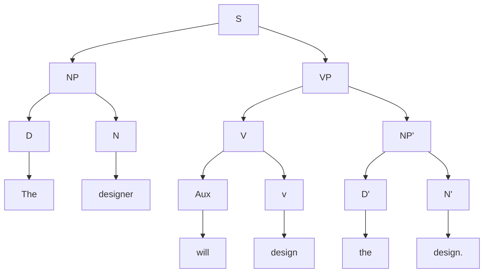

### Context free design program
v.2021-03-06 19:35:00 +7

<html lang="en">
   <head>
	 
    </head>
	 
<body>

graph LR
A--&gt;B

	
</body>

</html>

### Context free design program
v.2021-03-06 19:35:00 +7

